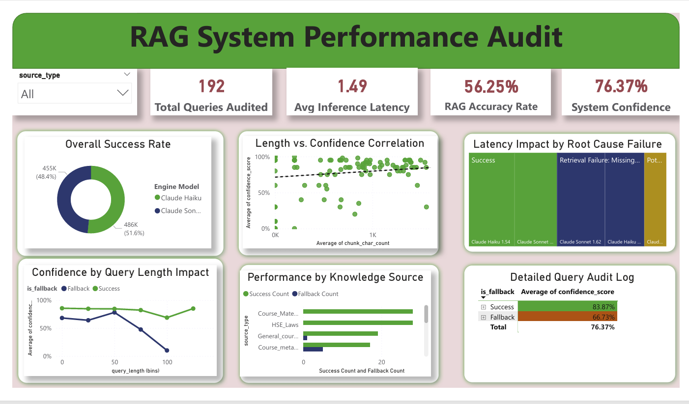

# 🚀 Automated RAG Analytics & Observability Pipeline

A modular end-to-end data analytics pipeline designed to monitor, evaluate, and visualize operational behavior inside Retrieval-Augmented Generation (RAG) systems. 

This project processes raw LLM/chatbot logs, engineers operational performance metrics, evaluates response grounding quality using advanced semantic audit metrics, and surfaces interactive insights through live Streamlit and Power BI dashboards.

---

# 📊 Automated RAG Production Pipeline Dashboard

An interactive data analytics platform to audit live system reliability, semantic evaluation metrics, and LLM trust gaps in production RAG frameworks.

## 🚀 Live Web Application

> ### 🖥️ **[Launch Live Streamlit Dashboard](https://dixit-rag-analytics.streamlit.app/)**
> *Click the link above to explore the interactive visualizations, executive KPIs, and system diagnostic suites live on the web.*

---

---

## 🖥️ Dashboard Analytics Preview

### 🎨 Power BI Visual Canvas Layout:


---

## 🎯 Problem Statement

Modern RAG systems generate large volumes of operational logs, but most AI applications lack centralized observability tooling to monitor system health. Key challenges include:

- **Hallucination Frequency:** Tracking how often the AI model hallucinates or invents data.
- **Retrieval Failures:** Identifying when the knowledge base fails to provide relevant context chunks.
- **Fallback Behavior:** Auditing system triggers when a user query drops to a safety or fallback layer.
- **Confidence Drift:** Monitoring changes in the distribution of model confidence scores over time.
- **Response Grounding Quality:** Evaluating how faithful the AI's final answer is to the retrieved document sources.

This project transforms raw chatbot logs into actionable operational intelligence for engineering and business stakeholders.

---

## 🏗️ Architecture & Data Flow

```text
       [ Raw CSV Logs ]
              │
              ▼
       [ Data Ingestion ] (src/ingestion.py)
              │
              ▼
 [ Data Cleaning & Processing ] (src/processing.py)
              │
              ▼
     [ Feature Engineering ] (src/features.py)
              │
              ▼
   [ Semantic Audit Metrics ] (src/audit.py)
              │
              ▼
    [ Local MySQL Database ] ───► [ Export to CSV ] (src/export.py)
              │                               │
              ▼                               ▼
     [ Power BI Dashboard ]        [ outputs/RAG_ML_Evaluation_Master.csv ]
      (Rag Dashboard.pbix)                    │
                                              ▼
                                    [ Streamlit Cloud App ]
                                          (app.py)

---

## 📊 Core Metrics Tracked

* **Query Analytics:** Active trend monitoring of unique incoming volume over time.
* **Retrieval Success Rate:** Accuracy checking based on successful vs. fallback system triggers.
* **Confidence Distribution:** Statistical average modeling of how confident the AI felt across category topics.
* **Response Faithfulness Evaluation:** Verifying how closely generated text matches technical document inputs.

## ⚡ Engineering Challenges Solved

* **Schema Alignment:** Automated structure standardization across mismatched raw CSV log files.
* **Nested Metadata Extraction:** Parsing unstructured context blocks to evaluate underlying chunk characters.
* **Dynamic Fallback Detection:** Pattern-matching algorithms that automatically catch and categorize system failures.

---

## 🛠️ Tech Stack & Tools

* **Language:** Python
* **Data Engineering:** Pandas, NumPy
* **Database Pipeline:** MySQL Server, SQLAlchemy Engine, MySQL-Connector
* **UI & Visualizations:** Streamlit Cloud, Plotly Express
* **Business Intelligence:** Power BI Desktop (Star Schema Data Model)
* **Environment Security:** Python-Dotenv

## ⚙️ Local Setup & Installation

1. Clone the Repository

```bash
git clone https://github.com/dixit-072/rag-dashboard-analysis.git
cd rag-dashboard-analysis
```

2. Install Required Dependencies

```bash
pip install -r requirements.txt
```

3. Launch the Local Dashboard

```bash
streamlit run app.py
```
  